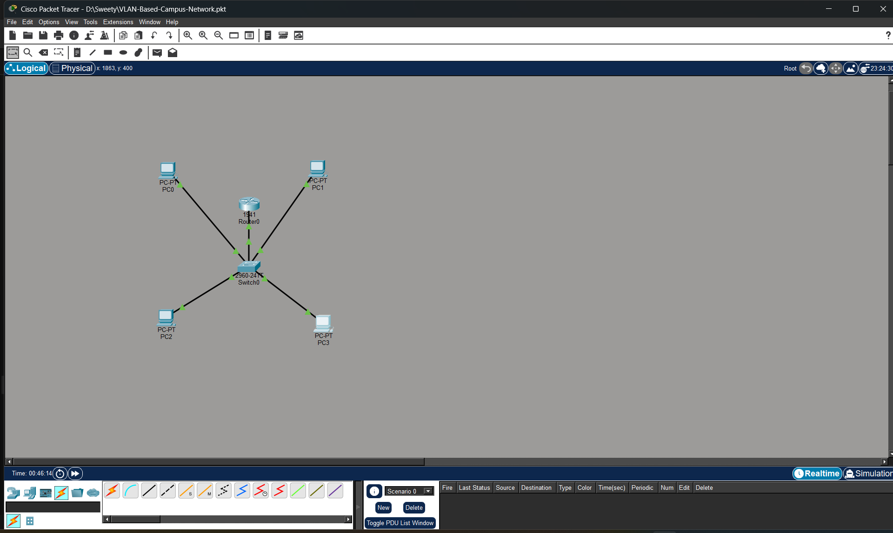
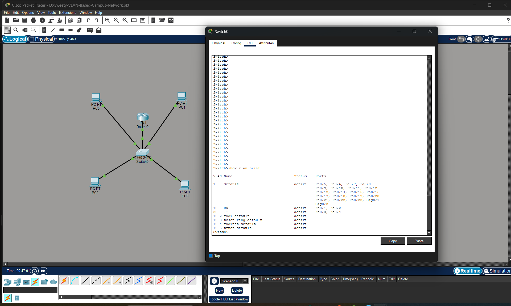
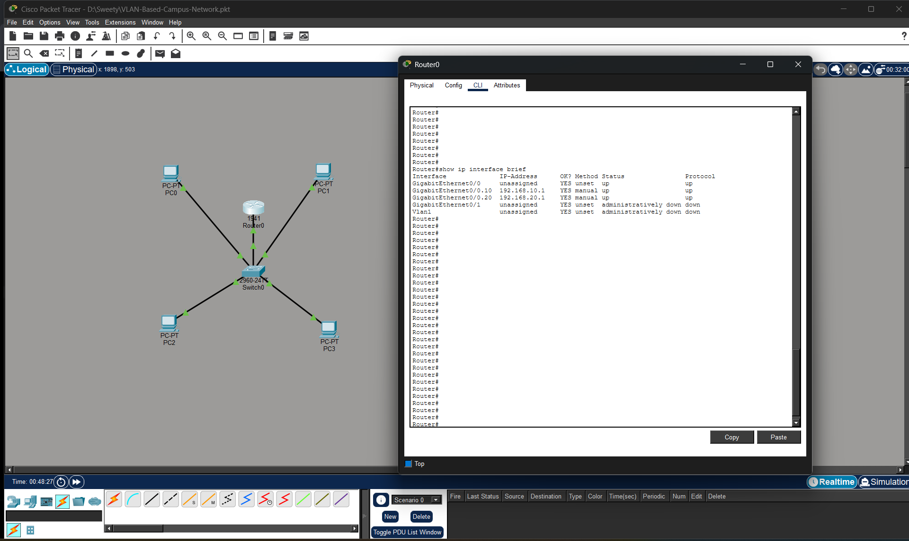
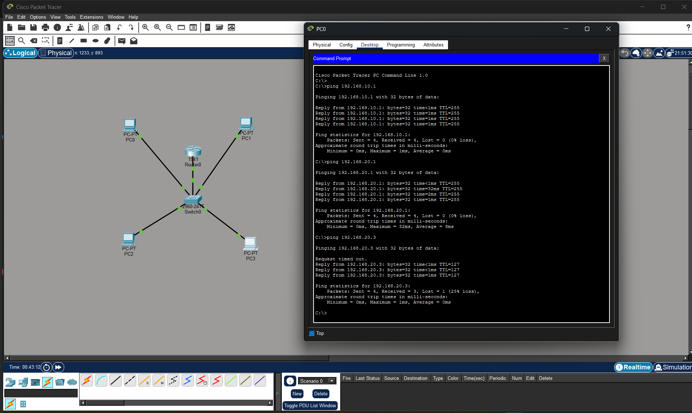

# VLAN-Based Campus Network Design

## Overview

Designed and simulated a VLAN-based campus network using Cisco Packet Tracer. The network separates departments into different VLANs and enables communication between them through Router-on-a-Stick inter-VLAN routing.

## Network Components

* Cisco 1941 Router
* Cisco 2960 Switch
* 4 PCs
* VLAN 10 (HR Department)
* VLAN 20 (IT Department)

## Features

* VLAN Segmentation
* Inter-VLAN Routing
* DHCP Address Assignment
* Trunk Port Configuration
* Network Connectivity Verification

## IP Addressing

### VLAN 10 (HR)

* Network: 192.168.10.0/24
* Gateway: 192.168.10.1

### VLAN 20 (IT)

* Network: 192.168.20.0/24
* Gateway: 192.168.20.1

## Validation

* Successful DHCP address assignment
* Successful connectivity tests between VLANs
* Successful router gateway reachability
* Verified inter-VLAN communication using ICMP ping

## Technologies Used

* Cisco Packet Tracer
* VLANs
* IEEE 802.1Q Trunking
* Router-on-a-Stick
* DHCP
* TCP/IP Networking

## Project Screenshots

### Network Topology

### VLAN Configuration

### Router Interfaces

### Connectivity Testing

